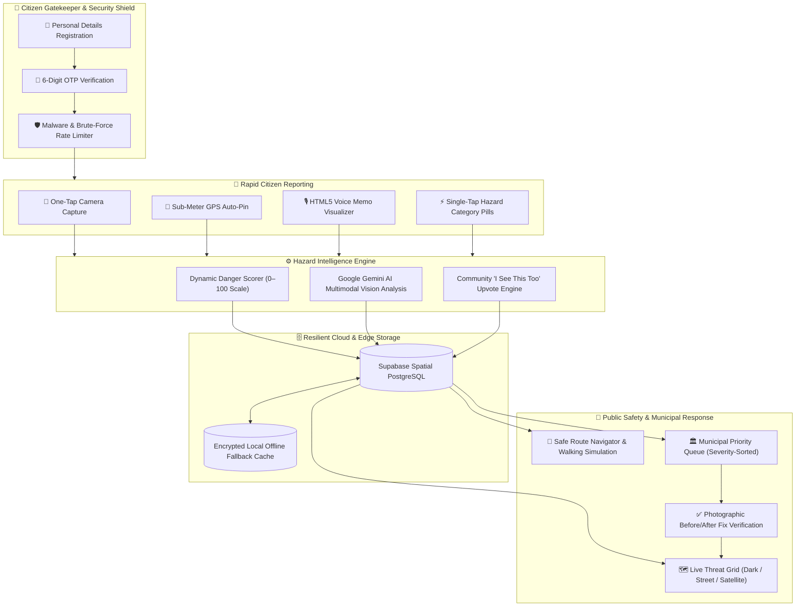

# 🚨 HazardSnap — Hyper-Local Civic Hazard Intelligence & Rapid Response Grid

TEAM: 2392608146-Obsidian
NAME: Vikas N
USN: 2392608146
MEMBERS:
2392608071 Aditya kumar
2392608146 Vikas N
2392608166 Arnav Patel
2392608154 Cherish Goyal
2392608124 Mayank Goyal
2392608142 Sujal Ganesh Nirgude

PPT LINK----
https://drive.google.com/drive/folders/1AoezRLdXyVIis4kTP4q1UBe-lu9GGXYJ?usp=sharing


PHOTOS----


> **Hackathon Submission**: Civic Tech & Urban Infrastructure Safety  
> *Transforming how citizens report street dangers and how municipal teams prioritize life-saving repairs.*
>
> 🌐 **Repository**: [https://github.com/VIKAS-555/hazardsnap](https://github.com/VIKAS-555/hazardsnap)  
> 🛡️ **Branch**: `main`

---

## 📌 Executive Summary

Every year, thousands of pedestrians, cyclists, and motorists suffer severe injuries and fatalities due to neglected street hazards: **uncovered stormwater manholes, dangling 11kV live power wires, road sinkholes, and flash-flooded underpasses**.

### The Real-World Problems
1. **Extreme Citizen Friction**: Existing civic reporting portals (grievance apps, municipal helplines) require 15+ mandatory form fields, bureaucratic department categorization, and cumbersome dropdowns. Frustrated commuters give up in seconds.
2. **Spatial Blindspots**: Municipal engineers and disaster response squads lack real-time spatial visibility into where hazards are clustered and which ones pose immediate lethal risk.
3. **The Accountability Void**: Citizen complaints are routinely marked "Resolved" in municipal backends without physical verification, leaving commuters skeptical and lethal hazards active.

### The HazardSnap Solution
HazardSnap delivers a **zero-friction, photo-first emergency response grid** built on high-performance web standards:
- **📸 5-Second Photo Logger**: Instant camera snap (`capture="environment"`), auto-GPS lock with reverse-geocoding, and in-browser voice memos.
- **🛡️ Secure Civic Gatekeeper**: Personal detail registration, 6-digit OTP verification, rate-limiting bot shields, and malware-safe payload sanitization.
- **🗺️ Live Civic Threat Grid**: Pure dark-mode geospatial map with **pulsing radar rings**, 65m danger perimeters, and multi-layer basemaps (Dark Grid, Street, Satellite).
- **🧭 Safe Route Navigator**: Automated detour engine that calculates safe pedestrian/driving paths around active hazards, featuring an interactive walking simulation.
- **🏛️ Municipal Severity-Ranked Queue**: Auto-scored triage board (0–100 danger rating) directing crews to life-threatening risks first.
- **✅ Photographic Fix Verification**: Tickets cannot be closed without an **"After-Fix" photo** and timestamped field log, providing an immutable Before/After audit trail.

---

## 🏗️ System Architecture & Data Flow



---

## ⚡ Flagship Capabilities

### 1. 🔐 Secure Gatekeeper & Citizen Onboarding
- **Clean Separation**: First-time visitors are welcomed by a dedicated, focused authentication portal before accessing the live command center.
- **Personal Detail Verification**: Captures verified citizen identity (Full Name, Phone Number, Email, Ward / Locality, Citizen ID) to deter malicious submissions.
- **OTP Verification Flow**: 6-digit security code verification with countdown resend timer and automated retry limits.
- **Anti-Malware & Abuse Protections**:
  - Client and edge input sanitization preventing XSS / SQL injection.
  - Strict MIME-type checking on media uploads.
  - Exponential backoff rate limiting against bot spamming.
- **Persistent Authenticated State**: Once signed in, citizens seamlessly enter the Command Center with zero session dropouts.

### 2. 📸 5-Second Rapid Citizen Logger
- **Camera First**: Direct shutter trigger with zero secondary clicks.
- **Sub-meter GPS Pin**: Captures device coordinates with accuracy radius and reverse-geocodes into street names via OpenStreetMap Nominatim.
- **Web Audio Voice Note**: In-browser recording via HTML5 `MediaRecorder` API with live waveform animation.
- **Standardized Hazard Danger Catalog**:
  | Category | Threat Level | Base Danger Score | Immediate Danger Profile |
  | :--- | :---: | :---: | :--- |
  | ⚡ **Dangling Live Wire** | **Critical** | `98 / 100` | High electrocution risk, sparking near puddles |
  | 🕳️ **Open Manhole** | **Critical** | `94 / 100` | Fatal pedestrian fall, two-wheeler axle destruction |
  | ⚠️ **Road Sinkhole / Cavity** | **Critical** | `95 / 100` | Structural asphalt collapse |
  | 🌊 **Severe Waterlogging** | **High** | `78 / 100` | Hidden submerged obstacles, vehicle engine seizure |
  | 🌳 **Fallen Tree / Branch** | **High** | `72 / 100` | Road blockage, snapped overhead utility lines |
  | 🚧 **Broken Footpath** | **Medium** | `62 / 100` | Tripping hazard, forces pedestrians into vehicular traffic |

### 3. 🗺️ Pure Dark-Mode Threat Map & Spatial Controls
- **Unified Controls**: One-click toggle between **🌙 Dark Grid (CartoDB Dark Matter)**, **🗺️ Street (OSM)**, and **🛰️ Satellite (Esri)**.
- **Pulsing Radar Rings**: High-voltage wires and open manholes emit animated red radar pulses for instant peripheral awareness.
- **Safety Buffer Perimeters**: 65-meter danger zones rendered on the map around critical active hazards.
- **One-Tap Community Validation**: Commuters can tap *"Confirm Hazard"* to upvote, boosting priority and verifying the hazard in real time.
- **Fullscreen & Recenter**: Quick toggle between split feed layout and immersive fullscreen map view.

### 4. 🧭 Safe Route Navigator (Automated Hazard Avoidance)
- **Real-Time Hazard Interception**: Analyzes coordinate paths against active threat radii.
- **Dynamic Detour Generation**: Calculates safe walking/driving detours routing commuters safely away from red-flagged hazard zones.
- **Route Comparison Matrix**:
  - 🚫 *Direct Unsafe Path*: Displayed as a red dashed line intercepting active critical hazards.
  - 🛡️ *Protected Safe Path*: Rendered as a glowing emerald corridor with real-time distance and time delta calculations.
- **Interactive Walking Simulation**: Step-by-step animated pedestrian simulation (`🚶`) following the safe path in real-time.

### 5. 🏛️ Municipal Priority Queue & Photographic Fix Proof
- **Severity-Ranked Triage**: Emergency crews automatically view tickets sorted by danger score (highest risk first).
- **Status Lifecycles**: `Reported` ➔ `Crew Dispatched` ➔ `Verified Fixed`.
- **Mandatory Photo-Proof**: Technicians must upload an **"After-Fix" photo** before a ticket can be closed.
- **Side-by-Side Audit Trail**: Citizens and municipal supervisors inspect side-by-side Before & After photos with timestamped work notes for complete transparency.

---

## 🛠️ Technology Stack

| Layer | Technology | Rationale |
| :--- | :--- | :--- |
| **Framework** | **Next.js 15 (App Router)** | High-speed server components, optimized asset bundling, production reliability |
| **Frontend UI** | **React 19 & Tailwind CSS** | Ultra-responsive, mobile-first design with high-contrast civic dark aesthetic |
| **Spatial Mapping** | **Leaflet & CartoDB / Esri** | Fast vector markers, radar animations, custom buffer geometry |
| **Audio Processing** | **HTML5 MediaRecorder API** | Native in-browser voice recording with zero third-party SDK dependencies |
| **Database & Auth** | **Supabase (PostgreSQL + RLS)** | Real-time spatial queries, row-level security, verified user sessions |
| **AI Classification** | **Google Gemini 1.5 Flash Vision** | Fast multimodal image understanding and hazard advisory synthesis |
| **Icons & Design** | **Lucide React** | High-clarity civic danger iconography |
| **Deployment** | **Vercel / Edge Network** | Instant edge delivery with automated CI/CD pipeline |

---

## 🏁 Judge Evaluation Rubric Alignment

| Criterion | How HazardSnap Solves It |
| :--- | :--- |
| **Innovation & Creativity** | Replaces bureaucratic 15-field portals with a 5-second camera snap, voice note, and automatic reverse-geocoding. |
| **Real-World Impact** | Prioritizes life-threatening risks (electrocution, open manhole falls) with algorithmic severity ranking and detour routing. |
| **Technical Execution** | Full-stack Next.js 15 + React 19 app with Leaflet spatial mapping, browser audio capture, Supabase database, and Gemini AI vision. |
| **Accountability & Trust** | Solves fake ticket closures by requiring photographic proof of fixes before tickets can be closed. |
| **Feasibility & Scalability** | PWA-ready, zero app installation required (runs directly in mobile browser), instant municipal utility. |

---

## 🚀 Quick Start Guide (Run Locally)

### 1. Prerequisites
- **Node.js**: v18.0.0 or later (v20+ recommended)
- **npm**, **yarn**, or **pnpm**

### 2. Clone and Install
```bash
# Clone the official repository
git clone https://github.com/VIKAS-555/hazardsnap.git
cd hazardsnap

# Install dependencies
npm install
```

### 3. Configure Environment Variables
Create a `.env.local` file in the root directory:
```env
# Supabase Cloud Configuration
NEXT_PUBLIC_SUPABASE_URL=https://scewuadxgpnggpypzubu.supabase.co
NEXT_PUBLIC_SUPABASE_ANON_KEY=sb_publishable_26zYJPkGrZA5OzhDLyjO3Q_dQ7OExG6

# Optional: Google Gemini API Key for AI Hazard Photo Classification
NEXT_PUBLIC_GEMINI_API_KEY=your_gemini_api_key
```
*(Note: If API keys are omitted, HazardSnap automatically uses its smart heuristic engine and resilient demo cache).*

### 4. Run the Development Server
```bash
npm run dev
```
Open **`http://localhost:3000`** in your browser.

### 5. Production Build Verification
```bash
npm run build
npm start
```

---

## 📄 License & Attribution
Developed with ❤️ for civic safety, pedestrian lives, and transparent urban governance.  
Released under the [MIT License](LICENSE).
