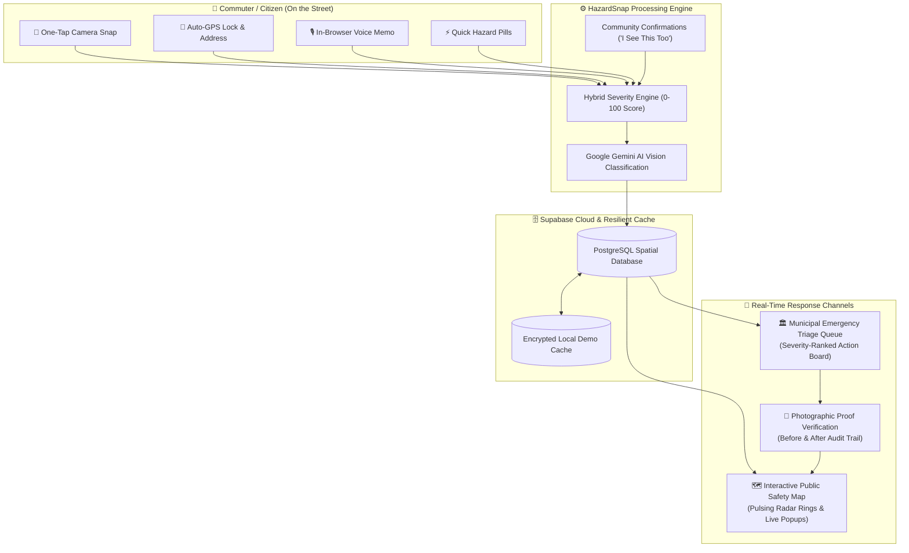

# 🚨 HazardSnap — Hyper-Local Civic Hazard Intelligence & Rapid Response Grid

> **Hackathon Submission**: Civic Tech & Urban Infrastructure Safety  
> *Transforming how citizens report street dangers and how municipal teams prioritize life-saving repairs.*

---

## 📌 Executive Summary

Every year, thousands of commuters suffer avoidable injuries and fatalities from preventable street hazards: **uncovered stormwater manholes, dangling 11kV live power wires, caved-in footpaths, and submerged roads**. 

### The Problem
- **Extreme Citizen Friction**: Existing civic reporting portals (grievance apps, municipal helplines) require 15+ mandatory form fields, account creation, and cumbersome dropdowns. Frustrated commuters give up.
- **Data Blindspots**: Municipal engineers have zero real-time spatial visibility into where hazards are concentrated or which ones pose an imminent danger to life.
- **The Accountability Void**: Complaints are routinely marked as "Resolved" in municipal backends without any physical proof, leaving citizens skeptical and dangers unaddressed.

### The HazardSnap Solution
HazardSnap removes 100% of the friction with a **5-second, photo-first reporting workflow** paired with an **AI-powered public safety grid**:
1. **📸 Photo-First & 5-Second Log**: Snap a photo or record a voice note on the move. High-accuracy GPS auto-pins the location with automated reverse-geocoding.
2. **🗺️ Public Safety Navigation Map**: Commuters see real-time color-coded hazard alerts with **pulsing radar warnings** around critical hazards (live wires & open drains) to navigate safely.
3. **🏛️ Municipal Severity-Ranked Triage Queue**: Incoming reports are automatically scored (0–100) and ranked by lethal danger so response units deploy to life-threatening risks first.
4. **✅ Photographic Fix Verification**: A hazard ticket **cannot be closed without an 'After-Fix' photograph and field log**, providing an immutable Before/After audit trail for the public.

---

## 🏗️ System Architecture & Data Flow



---

## ⚡ Core Features Built for Hackathon Judges

### 1. 5-Second Citizen Logger
- **Camera First**: Direct phone camera shutter launch (`capture="environment"`). Zero redundant clicks.
- **Sub-meter GPS Pin**: Captures device coordinates with accuracy radius and reverse-geocodes into street names via OpenStreetMap.
- **Web Audio Voice Note**: Records voice explanations using HTML5 `MediaRecorder` with dynamic audio wave visualizer and playback controls.
- **Single-Tap Preset Pills**:
  | Category | Threat Level | Base Danger Score | Immediate Danger Profile |
  | :--- | :---: | :---: | :--- |
  | ⚡ **Dangling Live Wire** | **Critical** | `98 / 100` | High electrocution risk, sparking near puddles |
  | 🕳️ **Open Manhole** | **Critical** | `94 / 100` | Fatal pedestrian fall, two-wheeler axle destruction |
  | ⚠️ **Road Sinkhole / Cavity** | **Critical** | `95 / 100` | Structural asphalt collapse |
  | 🌊 **Severe Waterlogging** | **High** | `78 / 100` | Hidden submerged obstacles, vehicle engine seizure |
  | 🌳 **Fallen Tree / Branch** | **High** | `72 / 100` | Road blockage, snapped overhead utility lines |
  | 🚧 **Broken Footpath** | **Medium** | `62 / 100` | Tripping hazard, forces pedestrians into vehicular traffic |

### 2. Commuter Public Safety Map
- **Pulsing Radar Wave**: Critical dangers emit animated red radar pulses directly on the map so users spot them at a glance.
- **One-Tap Community Validation**: Commuters can tap *"Confirm Hazard"* to upvote, boosting priority and verifying the hazard in real time.
- **Filter Controls**: Filter by hazard categories or toggle resolved items.

### 3. Municipal Priority Queue & Photographic Fix Proof
- **Severity-Ranked Triage**: Automatically orders tasks by danger score so emergency crews tackle high-voltage wires and open pits before cosmetic repairs.
- **Crew Dispatch Workflow**: Transition items seamlessly from `Reported` ➔ `Crew Dispatched` ➔ `Verified Fixed`.
- **Mandatory Photo-Proof**: Municipal workers must upload an **"After-Fix" photo** showing the repaired manhole or insulated cable.
- **Before & After Visuals**: Commuters and municipal supervisors can inspect side-by-side Before/After photos for total accountability.

### 4. Smart Hybrid AI Engine
- **Pre-calibrated Risk Weights**: Physical danger algorithms calibrated for urban traffic scenarios.
- **Google Gemini 1.5 Flash Vision**: Evaluates uploaded images and contextual notes to auto-detect hazard classes, calculate confidence, and generate commuter safety advisories.
- **Zero-Downtime Architecture**: Backed by a seamless local storage caching layer that ensures **100% demo uptime** even during network dropouts during live judging.

---

## 🛠️ Technology Stack

| Layer | Technology | Rationale |
| :--- | :--- | :--- |
| **Framework** | **Next.js 15 (App Router)** | Server-side optimization, fast routing, enterprise production readiness |
| **Frontend** | **React 19 & Tailwind CSS** | Ultra-responsive, mobile-first design with dark civic theme |
| **Mapping Engine** | **Leaflet + CartoDB Dark Matter** | Ultra-lightweight, high-performance spatial map rendering |
| **Audio Processing** | **HTML5 MediaRecorder API** | In-browser audio capture without third-party app dependencies |
| **Database** | **Supabase (PostgreSQL)** | Spatial indexing, row-level security (RLS), real-time sync |
| **AI Integration** | **Google Gemini 1.5 Flash Vision** | Fast image classification and multimodal hazard severity analysis |
| **Icons & UI** | **Lucide React** | High-clarity civic danger iconography |
| **Deployment** | **Vercel** | Edge network deployment with automated CI/CD pipeline |

---

## 🏁 Judge Evaluation Rubric Alignment

| Criterion | How HazardSnap Solves It |
| :--- | :--- |
| **Innovation & Creativity** | Replaces cumbersome 15-field bureaucratic forms with a 5-second camera snap, voice note, and automatic reverse-geocoding. |
| **Real-World Impact** | Directly targets life-threatening urban dangers (electrocution, open sewer falls, sinkholes) with automated severity ranking. |
| **Technical Execution** | Full-stack Next.js 15 + React 19 app with Leaflet interactive mapping, browser audio capture, Supabase database, and Gemini AI vision. |
| **Accountability & Trust** | Solves the "fake resolution" problem by requiring photographic proof of fixes before a ticket can be closed. |
| **Feasibility & Scalability** | Low deployment cost, zero app installation required (runs in mobile browser/PWA), instant municipal utility. |

---

## 🚀 Quick Start Guide (Run Locally)

### 1. Prerequisites
- **Node.js**: v18.0.0 or later (v22 LTS recommended)
- **npm** or **yarn** / **pnpm**

### 2. Clone and Install
```bash
# Clone the repository
git clone https://github.com/VIKAS-555/hazardsnap.git
cd hazardsnap

# Install dependencies
npm install
```

### 3. Configure Environment Variables
Create a `.env.local` file in the root directory:
```env
# Supabase Configuration
NEXT_PUBLIC_SUPABASE_URL=https://vltpqzsonqqxxzysaxdv.supabase.co
NEXT_PUBLIC_SUPABASE_ANON_KEY=your_supabase_anon_key

# Optional: Google Gemini API Key for automated hazard photo classification
NEXT_PUBLIC_GEMINI_API_KEY=your_gemini_api_key
```
*(Note: If no Supabase or Gemini keys are provided, the app automatically switches to its built-in smart heuristic engine and resilient demo cache).*

### 4. Run the Development Server
```bash
npm run dev
```
Open **`http://localhost:3000`** in your browser.

### 5. Production Build Verification
```bash
npm run build
npm start
```

---

## 🗺️ Product Roadmap & Next Iterations

- [ ] **Predictive Flooding Alerts**: Integrate IoT water level sensor feeds from storm drains to warn motorists before underpasses flood.
- [ ] **Turn-by-Turn Safe Routing**: Integration with Mapbox Navigation SDK to calculate pedestrian and two-wheeler paths that route around active critical hazard zones.
- [ ] **WhatsApp & Telegram Bot Gateway**: Allow citizens to forward a photo with location pin via WhatsApp to log hazards without opening a browser.
- [ ] **Automated Civic Karma Rewards**: Micro-incentives and civic badges for verified citizen reporters and spot-checkers.

---

## 📄 License & Attribution
Developed with ❤️ for civic safety and urban mobility. Released under the [MIT License](LICENSE).
